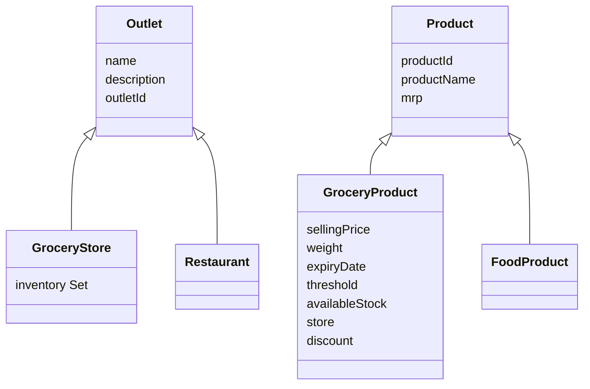
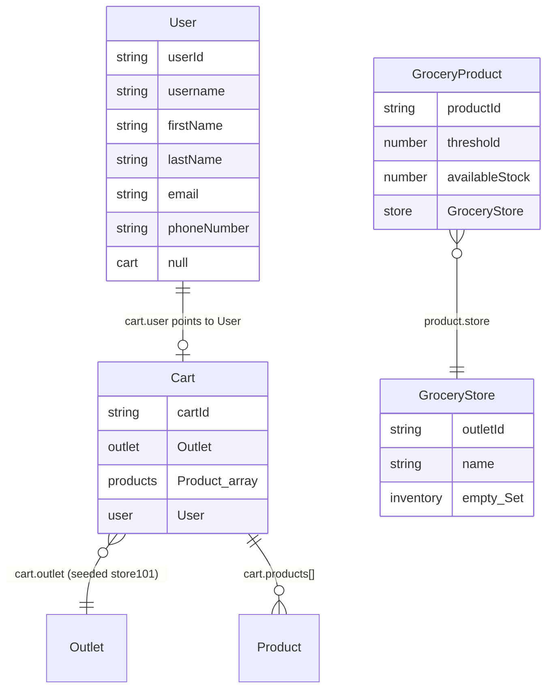
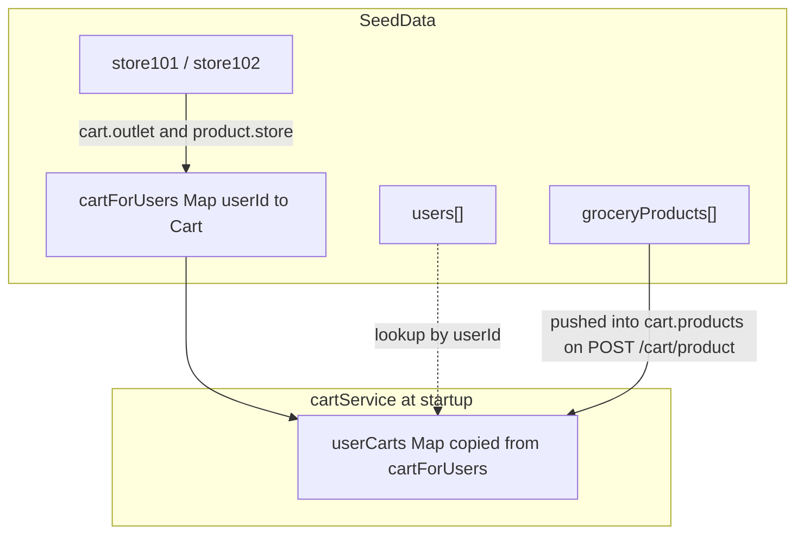

# JOI Delivery — Domain / entity relationships

Simple map of how objects relate in code today (after seed + add-to-cart).

## Inheritance

`Restaurant` / `FoodProduct` are empty stubs (broken named imports — see `CODE_SMELLS.md`).

## Runtime associations (what your e2e uses)

## How data is held (important asymmetry)

| Link | Wired today? |
|------|----------------|
| `Cart.user` → `User` | Yes (after seed fix) |
| `User.cart` → `Cart` | No — always `null` in seed |
| `Cart.outlet` → store | Yes — both carts use `store101` |
| `GroceryProduct.store` → store | Yes |
| `GroceryStore.inventory` → products | No — Set stays empty; catalog is `SeedData.groceryProducts` |
| User → Cart for HTTP | Via `cartService.userCarts.get(userId)`, not `user.cart` |

## Seed IDs (cheat sheet)

| Entity | IDs |
|--------|-----|
| Users | `user101` John, `user102` Rachel |
| Stores | `store101` Fresh Picks, `store102` Natural Choice |
| Products | `product101–103` on `store101` only |
| Carts | `cart101` / `cart102` keyed by userId in the Map |
